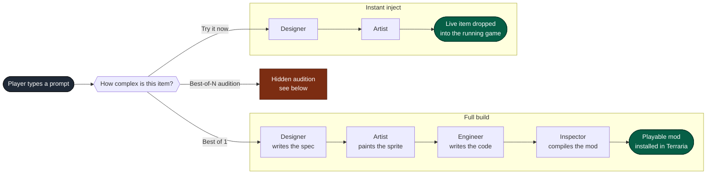
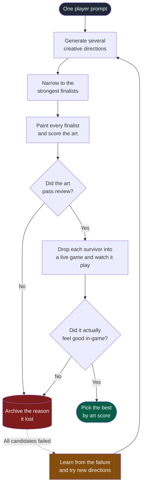
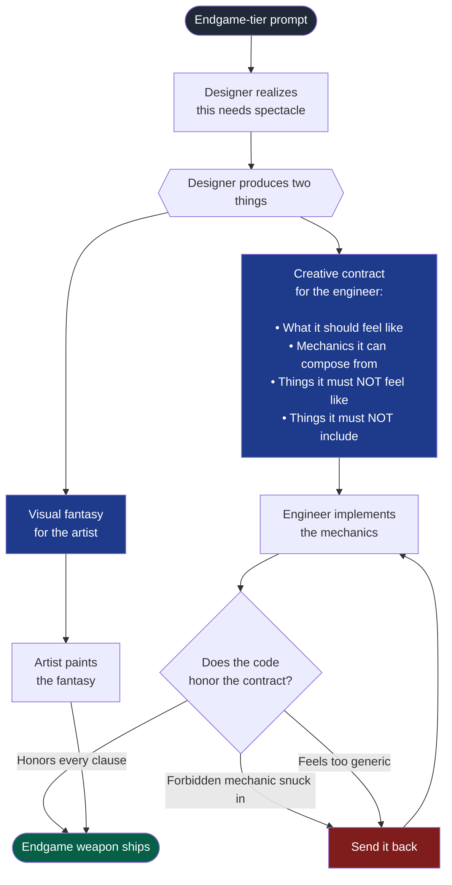
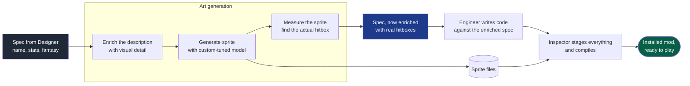

# The Forge
## Describe an item, The Forge can conceptualize it, generate art, make novel animations, write the code and inject the item, *without reloading the game*.

*all in the terminal*

<p align="center">
  
</p>

*see "a staff that shoots nyan-cat" below*


https://github.com/user-attachments/assets/b6fb6588-1519-402b-8b05-2df8b91a65f8


## Architecture (High Level)

### The whole thing — prompt to playable

```mermaid
flowchart LR
    P([“a frostbrand katana<br/>with rime-etched edge”])

    P --> ENGINE{{The Forge}}

    ENGINE --> D[A design]
    D --> A[A sprite]
    A --> C[Working code]
    C --> M[A compiled mod]
    M --> G([Swinging it<br/>in Terraria])

    style P fill:#1f2937,color:#fff,stroke:#111,stroke-width:2px
    style ENGINE fill:#1e3a8a,color:#fff,stroke:#0c1e4f,stroke-width:3px
    style D fill:#0f172a,color:#fff,stroke:#020617
    style A fill:#0f172a,color:#fff,stroke:#020617
    style C fill:#0f172a,color:#fff,stroke:#020617
    style M fill:#0f172a,color:#fff,stroke:#020617
    style G fill:#065f46,color:#fff,stroke:#022c22,stroke-width:2px
```



### The pipeline at a glance




### The hidden audition — how we pick winners



We don't trust the model's first idea, and we don't trust the art alone, a candidate also has to survive a live playtest before it can win. If everything fails, the system learns why and retries with a different angle.

### Endgame items; when the system gets ambitious



At the high end, the designer stops describing "a weapon" and starts producing a **creative contract** — a list of must-haves and must-not-haves. The reviewer enforces that contract literally on the code side, which is what stops endgame items from collapsing into generic weapon thats use stock projectiles.

### Where the data goes



The spec isn't a static document, it gets richer as it travels. The artist hands back real hitbox measurements before the engineer writes a line of code, which is why the resulting weapon feels physically correct in-game.

## Prerequisites

- Terraria with tModLoader installed
- Go `1.24+`
- Python `3.12+`
- Node `18+`
- Playwright runtime for reference image lookup

## Setup

### 1. Clone the repo

```bash
git clone https://github.com/Mikop22/the-forge.git
cd the-forge
```

### 2. API keys: *pending local mode for those of you with beefy gpus*

Copy the template and fill in your keys:

```bash
cp agents/.env.example agents/.env
# then edit agents/.env in your editor
```

Required keys:

```env
OPENAI_API_KEY=your-openai-key
FAL_KEY=your-fal-key
```

| Key | Use |
|-----|-----|
| `OPENAI_API_KEY` | Architect, Forge Master, orchestration |
| `FAL_KEY` | Pixelsmith image generation |

### 3. Pixelsmith weights (must have for terraria compatible sprites)

Download the sprite model weights into `agents/pixelsmith/`:

```bash
cd agents/pixelsmith
python download_weights.py
```

See `agents/README.md` for the expected weights workflow.

### 4. Python environment

```bash
cd agents
python3 -m venv .venv
source .venv/bin/activate
pip install -r requirements.txt
pip install fal-client playwright scikit-learn
playwright install chromium
```

### 5. Node dependency

```bash
cd agents/pixelsmith
npm install @fal-ai/client
```

### 6. Go dependencies

```bash
cd BubbleTeaTerminal
go mod download
```

### 7. Install `ForgeConnector`

`ForgeConnector` is the tModLoader mod that enables live injection and runtime status.

1. Copy `mod/ForgeConnector/` into your tModLoader `ModSources` directory:
   - macOS: `~/Library/Application Support/Terraria/tModLoader/ModSources/`
   - Windows: `Documents/My Games/Terraria/tModLoader/ModSources/`
   - Linux: `~/.local/share/Terraria/tModLoader/ModSources/`
2. Build `ForgeConnector` from tModLoader's mod tools
3. Enable it in the mod list

## Running The Forge

From `BubbleTeaTerminal/`:

```bash
go run .
```
```


## Supported Item Types

The orchestrator infers `sub_type` from prompt keywords (with substring-trap precedence — `pickaxe` beats `axe`, `broadsword` beats `sword`, `shotgun` beats `gun`).

| Class | Sub-types |
|---|---|
| Melee | Sword, Broadsword, Shortsword, Spear, Lance |
| Firearms | Pistol, Shotgun, Rifle, Repeater (uses bullets) |
| Bows | Bow, Repeater (also crossbow) |
| Magic | Staff, Wand, Tome, Spellbook (use mana) |
| Heavy ranged | Launcher (rockets), Cannon (custom) |
| Tools | Pickaxe, Axe, Hamaxe, Hammer (also deal melee damage) |

All ranged sub-types emit working `Item.shoot` and ammo/mana wiring; tools emit `Item.pick` / `Item.axe` / `Item.hammer` and route through `content_type=Tool` automatically.

## Power Tiers

| Tier | Damage | Examples |
|------|--------|----------|
| Starter | 8–15 | early-game, wood and iron |
| Dungeon | 25–40 | post-Skeletron |
| Hardmode | 45–65 | post-Wall of Flesh |
| Endgame | 150–300 | post-Moon Lord |

## Project Structure

```text
the-forge/
├── BubbleTeaTerminal/
│   ├── main.go
│   ├── screen_forge.go
│   ├── screen_staging.go
│   └── internal/
│       ├── ipc/
│       └── modsources/
├── agents/
│   ├── orchestrator.py
│   ├── contracts/
│   ├── core/
│   ├── architect/
│   ├── pixelsmith/
│   ├── forge_master/
│   └── gatekeeper/
└── mod/
    └── ForgeConnector/
```

## Reference-Aware Generation

When a prompt references a known object, weapon, or character, the pipeline can fetch references and use them to guide sprite generation.
