# The Forge
### Describe an item, The Forge can conceptualize it, generate art, make novel animations, write the code and inject the item, *without reloading the game*.

*A Claude Code skill that drives a local MCP server, which compiles, generates sprites, and live-injects items into Terraria.*

<p align="center">
  
</p>

*"a staff that shoots nyan-cat"*


https://github.com/user-attachments/assets/b6fb6588-1519-402b-8b05-2df8b91a65f8


## Architecture

```mermaid
flowchart LR
    USER([/forge a void pistol<br/>that charges before firing/])

    USER --> SKILL{{Forge skill<br/>orchestrator}}

    SKILL --> TIER[Infer tier 1/2/3<br/>from prompt]

    TIER --> SUBS

    subgraph SUBS[Subagents]
        direction TB
        T[Architect-Thesis<br/>3 distinct concepts]
        M[Architect-Manifest<br/>full spec]
        C[Coder<br/>C# source]
        R[Reviewer<br/>deterministic critique]
        RF[Reference-Finder<br/>only for named IP]
        SJ[Sprite-Judge<br/>vision pick]
    end

    SUBS --> MCP{{MCP tools}}

    subgraph MCP[forge MCP server]
        direction TB
        S1[forge_compile]
        S2[forge_generate_sprite]
        S3[forge_status]
        S4[forge_inject]
    end

    MCP --> CONN[ForgeConnector<br/>C# mod, file watcher]

    CONN --> GAME([Item appears in<br/>running Terraria])

    style USER fill:#1f2937,color:#fff,stroke:#111
    style SKILL fill:#1e3a8a,color:#fff,stroke:#0c1e4f,stroke-width:3px
    style TIER fill:#0f172a,color:#fff
    style GAME fill:#065f46,color:#fff,stroke:#022c22,stroke-width:2px
```



`.claude/skills/forge.md` runs the orchestration. It picks a tier from the prompt, dispatches subagents with the appropriate model for each role, calls four MCP tools, and `ForgeConnector` (a tModLoader mod watching `forge_inject.json`) drops the item into your running game.

### Subagent model assignments

| Subagent | Model | Why |
|---|---|---|
| Architect-Thesis | Sonnet | Generates 3 distinct concepts from the prompt |
| Architect-Manifest | Sonnet | Expands the winning concept into a full spec |
| Coder | Haiku (T1) / Sonnet (T2-3) | Tier 1 is mechanical; T2-3 needs judgment for charge phases, beam lances, etc. |
| Reviewer | Haiku | Runs a deterministic critique checklist. No design judgment needed. |
| Reference-Finder | Sonnet | Only triggered for specific named IP (e.g. Nyan Cat). Hard-capped at 2 web searches + 3 fetches. |
| Sprite-Judge | Opus | Picks the best sprite candidate. Vision quality matters here. |

### Tier inference

The skill picks the lowest tier that fits the prompt:

| Tier | Signal | What it builds |
|---|---|---|
| 1 | "simple", "basic", "starter", or just damage + use time | `SetDefaults` + `AddRecipes` |
| 2 | One special mechanic (homing, piercing, on-hit buff/debuff, bouncing) | Tier 1 + 1-2 mechanics atoms |
| 3 | Charge phases, multi-projectile payoff, sweep/beam, "void", "forbidden" | Full `Projectile.ai[]` state machine, secondary spawns, beam line collision |

## Using `/forge`

Once the MCP server is running and the skill is loaded:

```
/forge a void pistol that charges before firing
/forge simple starter sword
/forge a homing missle staff
```

The skill will:
1. Tell you which tier it picked and why
2. Show you 3 named concepts. Pick one, or say "you choose".
3. Compile + review in a loop (silent for the first 3 attempts, surfaced after 4/6)
4. Generate sprite candidates with FLUX.2 Klein
5. Pick the best item + projectile sprite
6. Inject and tell you the crafting recipe

If a candidate fails compile or the deterministic reviewer, the skill respawns the Coder with the specific errors. The compile + reviewer loop shares a global 6-attempt budget.

## Setup

### Prerequisites

- Terraria with **tModLoader** installed
- **Python** `3.12+`
- **Claude Code** (or another MCP-capable IDE)
- API keys: `OPENAI_API_KEY`, `FAL_KEY`

### 1. Clone and install Python deps

```bash
git clone https://github.com/Mikop22/the-forge.git
cd the-forge/agents
python3.12 -m venv .venv
.venv/bin/pip install -r requirements.txt
```

The MCP server wrapper at `agents/mcp_server_start.sh` runs out of `agents/.venv`, so the venv path is fixed.

### 2. API keys

```bash
cp agents/.env.example agents/.env
# edit and fill in OPENAI_API_KEY and FAL_KEY
```

| Key | Use |
|-----|-----|
| `OPENAI_API_KEY` | Backup LLM calls (most agent traffic now goes through Claude) |
| `FAL_KEY` | Pixelsmith image generation (`forge_generate_sprite`) |

### 3. Pixelsmith weights

```bash
cd agents/pixelsmith
python download_weights.py
```

### 4. Install `ForgeConnector`

`ForgeConnector` is the tModLoader mod that watches `forge_inject.json` and live-injects items.

1. Copy `mod/ForgeConnector/` into your tModLoader `ModSources` directory:
   - macOS: `~/Library/Application Support/Terraria/tModLoader/ModSources/`
   - Windows: `Documents/My Games/Terraria/tModLoader/ModSources/`
   - Linux: `~/.local/share/Terraria/tModLoader/ModSources/`
2. Build it from tModLoader's mod tools and enable it in the mod list.

### 5. Restart Claude Code

The `.mcp.json` at the repo root registers the forge MCP server automatically. Restart Claude Code to pick it up. `/mcp` should then show `forge` as connected with 4 tools.

### Optional environment overrides

| Variable | Purpose |
|---|---|
| `FORGE_MOD_SOURCES_DIR` | Override ModSources root if auto-discovery fails |
| `TMODLOADER_PATH` | Point at `tModLoader.dll` if `dotnet` build can't find it |

`mod_sources_dir` in `~/.config/theforge/config.toml` is also honored.

## MCP tools

`agents/mcp_server.py` registers a **FastMCP** server named `forge`:

| Tool | Role |
|------|------|
| `forge_status` | Reads `forge_connector_alive.json` and `generation_status.json` to report heartbeat + pipeline stage |
| `forge_compile` | Stages C# + localization hjson under `agents/.forge_staging/<id>/`, runs `dotnet tModLoader.dll -build`, parses CS####/TML### diagnostics |
| `forge_generate_sprite` | Runs Pixelsmith audition (FLUX.2 Klein, lora=0.65, guidance=7) and returns candidate paths for the Sprite-Judge to pick from |
| `forge_inject` | Promotes the staged build into `ForgeGeneratedMod`, copies sprite PNGs, writes `forge_inject.json` for ForgeConnector to consume |

## Supported item types

The codegen path infers `sub_type` from prompt keywords. Substring-trap precedence applies: `pickaxe` beats `axe`, `broadsword` beats `sword`, `shotgun` beats `gun`.

| Class | Sub-types |
|---|---|
| Melee | Sword, Broadsword, Shortsword, Spear, Lance |
| Firearms | Pistol, Shotgun, Rifle, Repeater (uses bullets) |
| Bows | Bow, Repeater (also crossbow) |
| Magic | Staff, Wand, Tome, Spellbook (use mana) |
| Heavy ranged | Launcher (rockets), Cannon (custom) |
| Tools | Pickaxe, Axe, Hamaxe, Hammer (also deal melee damage) |

All ranged sub-types emit working `Item.shoot` and ammo/mana wiring; tools emit `Item.pick` / `Item.axe` / `Item.hammer` and route through `content_type=Tool` automatically.

## Power tiers

| Tier | Damage | Examples |
|------|--------|----------|
| Starter | 8-15 | early-game, wood and iron |
| Dungeon | 25-40 | post-Skeletron |
| Hardmode | 45-65 | post-Wall of Flesh |
| Endgame | 150-300 | post-Moon Lord |

## Reference-aware generation

Some prompts name a specific real-world or copyrighted subject the diffusion model can't generate from text alone (a named anime character's sword, a sports team logo, Nyan Cat). For those, the skill spawns a Reference-Finder that pulls one image and feeds it to Pixelsmith for img2img. Generic fantasy weapons (swords, wands, bows, staffs, orbs, guns) skip the reference step entirely. The Reference-Finder is hard-capped at 2 web searches and 3 fetches to keep token cost predictable.

## Project structure

```text
the-forge/
├── .claude/
│   ├── skills/forge.md           # orchestrator skill (subagent prompts, tier rules)
│   └── commands/forge.md         # /forge slash command
├── .mcp.json                     # MCP server registration
├── agents/
│   ├── mcp_server.py             # FastMCP: forge_status / compile / sprite / inject
│   ├── mcp_server_start.sh       # wrapper that runs the venv Python
│   ├── .venv/                    # local venv (gitignored)
│   ├── core/                     # paths, staging, hjson, compile harness
│   ├── pixelsmith/               # FLUX.2 sprite generation + gates
│   ├── gatekeeper/               # legacy Integrator path (not used by mcp_server)
│   ├── tests/                    # pytest
│   ├── qa/                       # corpus, run artifacts
│   └── requirements.txt
├── mod/
│   └── ForgeConnector/           # tModLoader live inject + file watcher
└── archive/                      # legacy Go TUI + monolithic Python orchestrator
```

## Troubleshooting

| Symptom | Fix |
|---|---|
| `/mcp` shows `forge` as `failed` | Restart Claude Code so it picks up `.mcp.json` and `mcp_server_start.sh` |
| `ModuleNotFoundError: No module named 'mcp'` | Run `agents/.venv/bin/pip install -r agents/requirements.txt` |
| `art_direction` import error during sprite gen | numpy in your venv is broken; rebuild the venv from scratch |
| Compile loop exhausts 6 attempts | Surface the errors to the user; usually a manifest/codegen mismatch the reviewer can't fix mechanically |
| `ForgeConnector` offline warning | Make sure tModLoader is running with the mod enabled before `/forge` reaches the inject step |
