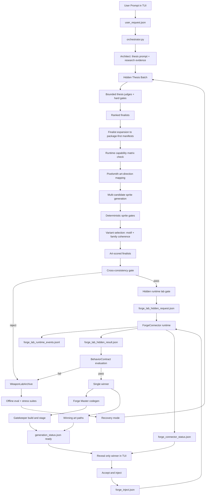
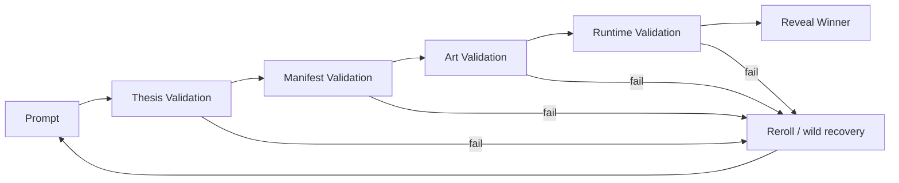
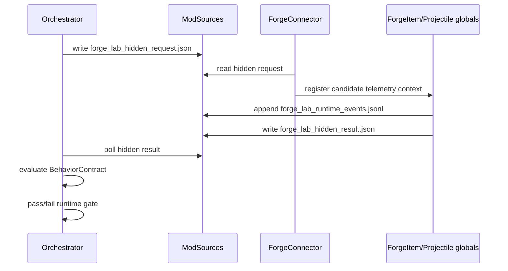

# Weapon Lab System Diagram

## Full System

## Validation Layers

## Runtime Evidence Path

## Key Files

- `agents/orchestrator.py`
- `agents/architect/research_evidence.py`
- `agents/architect/weapon_thesis_prompt.py`
- `agents/architect/thesis_generator.py`
- `agents/core/runtime_capabilities.py`
- `agents/core/weapon_lab_archive.py`
- `agents/core/weapon_lab_ranking.py`
- `agents/core/cross_consistency.py`
- `agents/core/runtime_contracts.py`
- `agents/core/recovery_mode.py`
- `agents/pixelsmith/art_direction.py`
- `agents/pixelsmith/sprite_gates.py`
- `agents/pixelsmith/pixelsmith.py`
- `mod/ForgeConnector/ForgeLabTelemetry.cs`
- `mod/ForgeConnector/ForgeConnectorSystem.cs`
- `mod/ForgeConnector/ForgeItemGlobal.cs`
- `mod/ForgeConnector/ForgeProjectileGlobal.cs`
